# Digital Forensics Network Forensics Challenge
## Created by: Tom Danner, Devin Ingresoll, Jesse Reed, Vitaliy Tsytsyk
### The Authors:
<p align="center">
  
</p>
<p align = "center">
  Devin Ingersol,
  Vitaliy Tsytsyk,
  Jesse Reed,
  Tom Danner
 </p>

### Software/Tools Used:
<p align="center">
  
</p>

#### Overview

Wireshark is a tool used for capturing/sniffing packets and analyzing packet captures.

#### Installing Wireshark
Windows/macOS: You can download the installer from their website here: https://www.wireshark.org/

Linux: Search for wireshark-qt using your respective distro's methods and select the most up to date version. A few have been included here.

Ubuntu

`sudo apt-get install wireshark`

Arch

`sudo pacman -S wireshark-qt`

Redhat/CentOS
```
sudo yum install gcc gcc-c++ bison flex libpcap-devel qt-devel gtk3-devel rpm-build libtool c-ares-devel qt5-qtbase-devel qt5-qtmultimedia-devel qt5-linguist desktop-file-utils
sudo yum install wireshark wireshark-qt
```

<p align="center">
  
</p>

#### Overview

TShark is the CLI counterpart of Wireshark. It enables the user to perform many of the same tasks they can do in Wireshark through the CLI instead. It also allows users to create scripts to automate the packet capture analysis process.

#### Installing TShark
Windows: (Requires choclatey to be installed) `choco install wireshark`

macOS: (Requires brew to be installed) `brew cask install wireshark`

Linux: By default it is included when installing Wireshark. Refer to the Wireshark installation steps for your respective distro.

### Topics Covered:
1. TCP/IP packet structure. An Overview/Introduction to Wireshark.
2. Basic Packet Analysis, Sorting, and Filtering in Wireshark.
3. Advanced Packet Analysis in Wireshark.
4. An Overview/Introduction to TShark.

## Overview:
Network Forensics is a crucial part of digital forensics and its importance continues to grow everyday.
Almost all personal computers and servers are going to have built-in networking capabilities, such as wi-fi or ethernet, allowing them to communicate with other devices across the internet.
These connections can be used to transfer illegal files, deny normal service, and allow malware to go on and become viral.                                                                                                                                                           

Network data can also be difficult to track due to the huge volume and voliticity of conversations between devices.                                                                                                                                                                      
As a result of this, networking data has to be deliberatly listened to and saved for analysis in order to extract evidence. This is called "sniffing."                                                                                                                                                                

In our overview of network forensics we will first cover the most common language that computers communicate with: the TCP/IP packet structure.                                                                                                                              
After we learn how to read these, we'll dive into how you can aquire and analyse network information with one of the most common tools in the field: Wireshark!                                                                                                                  
Once we have the basics down, we'll lastly take a look at some more advanced topics dealing with Wireshark and TShark.


## TCP/IP packet structure and An Overview/Introduction to Wireshark
### Opening a Packet
Before we dive deep into Wireshark, we first need to understand what we will be looking at.  
This all starts with understanding the IP packet structure\!  
When we look at network traffic, we will often be looking at TCP/IP packets so this is where we will start.  
 


*This is what a packet looks like in Wireshark.*  

We can see the HEX and ASCII text on the right side and what this translates to on the left.  
Almost all packets can be understood using the seven layers of the OSI / networking model:  

- **Physical Layer**        
_Includes information about the packet as a whole_   
  - Arrival Time  
  - Encapsulation type (usually Ethernet)      
  - Frame number and length  
  - Protocol inside          
- **Data Link layer**  
_Transferring from device <-> device_
  - Destination and Source MAC address        
- **Network Layer**  
_Usually over IPv4 or IPv6_  
_client <-> host_         
  - IP addresses of client and server
  - IP version
  - Time to live
- **Transport Layer**  
_Usually either TCP or UDP_
  - Source and Destination Port number
  - Sequence number
- **Session/Application Layer (_the rest of it_)**  
_The actual protocol data_
  - depends on which protocol is used
  - in our example, Telnet includes data such as a **password** being sent in plain text!!!
  
Having a basic understanding of how packets can be analyzed will help greatly as we look more into network forensics with Wireshark.

### Using Wireshark
After installing, and running the software we need to select a network device to start monitoring (named eth0, Wi-Fi, etc)  
 > **NOTE:** Program may need to be ran as an _Administrator_    

Once we select a device, we immediately start collecting incoming packets.
There are four main windows here:
 - Command Menu w/ Display filter
 - Packet Listing
 - Packet Details 
 - Packet Bytes  
 
To pause the current session, click the red square at the top right (start again with the green fin)  
You can click on any packet to further analyze it in the _Packet Details_ and _Packet Bytes_ frames.

In the Packet Listing section you can see the Packet Number, time since first packet, Source and Destination IP address, Protocol, Length of the package in bytes, and :star: package info :star:  
Package info is very useful for gaining quick intel.  
If you're wondering what a specific protocol does, your friend Google is always there to help! 

This is really all you need to know to get started in Wireshark, so lets start looking at some of the cool things you can do!

## Basic Packet Analysis, Sorting, and Filtering in Wireshark

### Packet Analysis

#### The Tip of The Iceberg

Packets (also referred to as frames) contain a large amount of information, so it's always best to start with what we can see easily. Let's take a look at the _Packet Listing_ window and gather the information from there first. We are going to use `Basics.pcap` in this section.

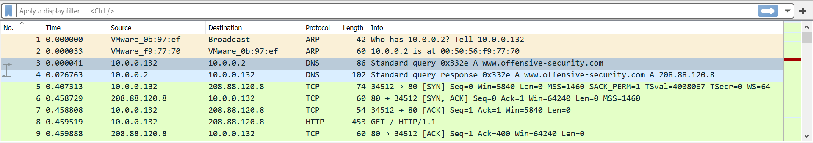  
_Screenshot of the Packet Listing window_  

We will be analyzing packet #3.
Just by looking at all the sorting columns that correspond to our packet (row), we can gather the following information:

- **Number**: 3  
_The packet's number in the current capture file_
- **Time**: 0.000041  
_Absolute time since the beginning of the capture (in seconds)_
- **Source**: 10.0.0.132  
_The system that sent the packet. In most cases, the IPv4 address_
- **Destination**: 10.0.0.2  
_The system that received the packet. In most cases, the IPv4 address_
- **Protocol**: DNS  
_An application layer protocol that the packet used_
- **Length**: 86  
_Number of bytes in this packet_
- **Info**: Standard query 0x332e A www.offensive-security.com  
_Summary of the information in the highest layer protocol_

This is the easiest way to see the most common information about the packets. However, there is much more that can be uncovered.

#### Digging Deeper

Glancing at the _Packet Listing_ is always nice, but it's rarely enough. If we want to learn more about the packet, we should click on it and explore the _Packet Details_. We have already discussed what information goes in each one of the layers (drop down rows) in the previous section, so it will be easier to analyze our specific DNS packet now. We will start from the top of the list with the physical layer and work our way to the bottom - the "highest" protocol.

##### Physical Layer

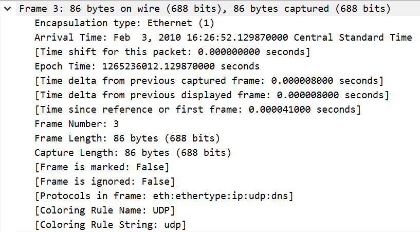  
_Screenshot of the physical layer information we have about the DNS packet._  

There are plenty of rows to look at and there are lots of resources out there that break them all down, but right now we are just going to focus on the most important information:

- **Arrival Time**: Feb 3, 2010 16:26:52.129870000 Central Standard Time  
_Time of the packet arrival at the destination_
- **Epoch Time**: 1265236012.129870000  
_Also called UNIX time, this is the number of seconds since January 1, 1970_
- **Frame Number**: 3  
_Packet number in this capture_
- **Frame Length**: 86 bytes (688 bits)  
_Packet length_
- **Protocols in frame**: eth:ethertype:ip:udp:dns  
_All protocols used by the packet (by layer)_  

##### Data Link Layer

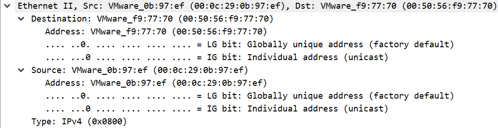  
_Screenshot of the data link layer information we have about the DNS packet._  

- **Destination**: VMware_f9:77:70 (00:50:56:f9:77:70)  
_Destination MAC address_  
- **Source**: VMware_0b:97:ef (00:0c:29:0b:97:ef)  
_Source MAC address_  
- **Type**: IPv4 (0x0800)  
_Indicates which upper layer protocol should be used_  

##### Network Layer

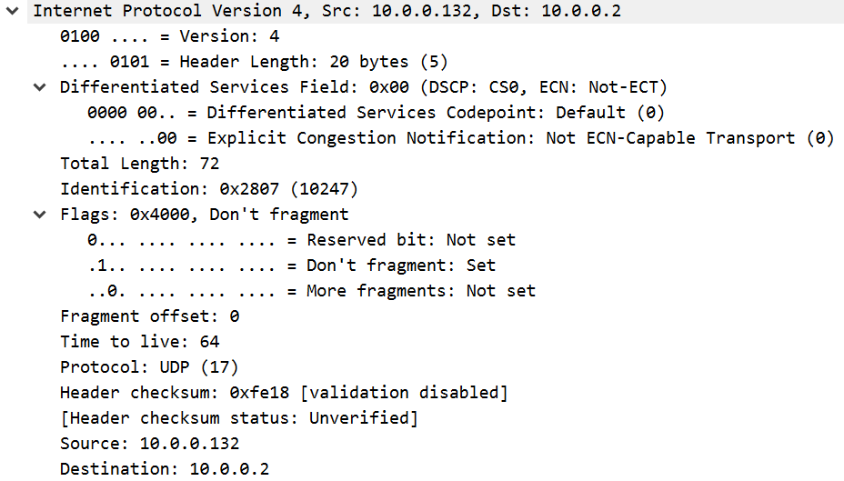  
_Screenshot of the network layer information we have about the DNS packet._  

- **Total Length**: 72  
_Length of the IP packet (20 bytes - the header, the rest - data)_  
- **Identification**: 0x2807 (10247)  
_A unique ID of the IP packet_  
- **Flags**: 0x4000, Don't fragment  
_Any flags set for the packet. In our case, "Don't fragment" bit is set to 1, which forbids packet fragmentation_  
- **Time to live**: 64  
_The maximum time (in seconds) the packet is allowed to exist on the network_  
- **Protocol**: UDP (17)  
_Indicates which upper layer protocol should be used. Number inside the parentheses indictes an assigned port number for that protocol on the IP layer_  
- **Header checksum**: 0xfe18 \[validation disabled]  
_The header checksum value and its validation status_  
- **Source**: 10.0.0.132  
_An IPv4 address of the system that sent the packet_
- **Destination**: 10.0.0.2  
_An IPv4 address of the system that received the packet_

##### Transport Layer

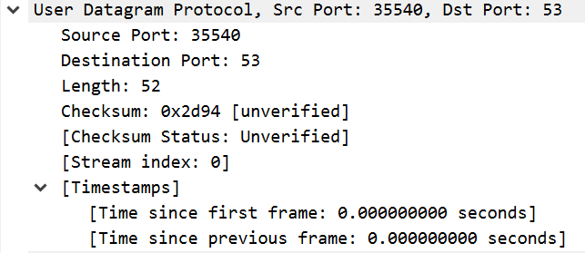  
_Screenshot of the transport layer information we have about the DNS packet._  

- **Source Port**: 35540  
_Port from which the packet has been sent_  
- **Destination Port**: 53  
_Port to which the packet has been sent_  
- **Length**: 52  
_Length of the UDP packet (8 bytes - the header, the rest - data)_  
- **Checksum**: 0x2d94 \[unverified]  
_The checksum value and its verification status_  

##### Application Layer

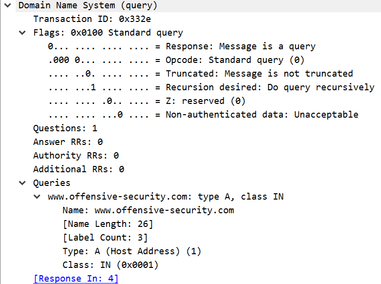  
_Screenshot of the application layer information we have about the DNS packet._  

- **Transaction ID**: 0x332e  
_A unique ID of the query-response pair_  
- **Flags**: 0x0100 Standard query  
_Any flags set to the packet. In our case, this packet is a query (0), a standard one (0), not truncated (0), recursively done (1), Z reserved (0), and doesn't accept non-authenticated data (0)_  
- **Questions**: 1  
_Number of requests_  
- **Answer RRs**: 0  
_Number of answers_  
- **Queries**: www.offensive-security.com: type A, class IN  
_All requests included in this packet. In our case, we only have one_  

As we can see, there is plenty of information about the packets that we can access with Wireshark. All the things we were able to tell about the DNS query packet #3 is visible by just clicking on the packet in the _Packet Listing_ window and paying close attention to the fields. However, this is a single packet. What if we want to search through hundreds of packets to find something specific? This is where our next topic comes in - sorting and filtering.

### Sorting and Filtering

#### Sorting Columns

Let's look back at where we started: the _Packet Listing_ window. We saw all the standard columns like **Number** or **Protocol**. But what if we want to sort captured packets by something else? For example, the **Destination Port**? 

This is actually fairly simple. All we have to do is select any packet that contains the desired field, just like our DNS query packet #3, right click the **Destination Port** field (in our case), and select `Apply as a Column`. We can also use the `Ctrl + Shift + I` once the field has been highlighted.

Now we should be able to see the newly added sorting column next to all the standard ones.

#### Display Filter

The easiest way to filter the packets is by using Wireshark's _Display Filter_ that is located right under the _Command Menu_.  

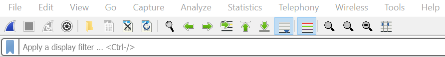  
_Screenshot of the Command Menu and the Display Filter_  

_Display Filter_ doesn't quite work the way `Ctrl + F` does on the web pages, so it's important to understand the correct way to build the expressions.

Let's look at the basic syntax.  

- To only display packets containing a specific protocol - just type in that protocol.  
_For example, `http`_  

- To filter them out further - type in that protocol, period, and further filtering options.  
_For example, to only show the http responses - type in `http.response`_  

- To compare values - use the comparison operators. Wireshark supports both C-like and English syntax for them.  
_For example, to only show packets with the source IP address 10.0.0.2 - type in `ip.src == 10.0.0.2` or `ip.src eq 10.0.0.2`_  

- To combine expressions - use the logical operators. Wireshark supports both C-like and English syntax for them.  
_For example, to only show packets with the source IP address 10.0.0.2 or the source IP address 10.0.0.132 - type in `ip.src == 10.0.0.2 || ip.src == 10.0.0.132` or `ip.src eq 10.0.0.2 or ip.src eq 10.0.0.132`_  

For more detailed explanation and extra content check out the [Wireshark's User Guide on Building Display Filter Expressions](https://www.wireshark.org/docs/wsug_html_chunked/ChWorkBuildDisplayFilterSection.html).  

## Advanced Packet Analysis in Wireshark
Aside from basic packet analysis, there's significantly more Wireshark is capable of. In this section we'll examine two ways Wireshark can go beyond simply looking at packets: extracting files and VoIP analysis.

### Extracting Files
When analyzing PCAP files, it's not uncommon to come across HTTP packets that were sent to request files be retrieved such as images when visiting websites, websites themselves, videos, and more. While we can get an idea of what the file might look like just from examining the packet, we can take it a step further and reconstruct/export the file to view it ourselves. 

In order to do this, first go to the File menu, mouse down to the Export Objects menu, and then select the HTTP option.

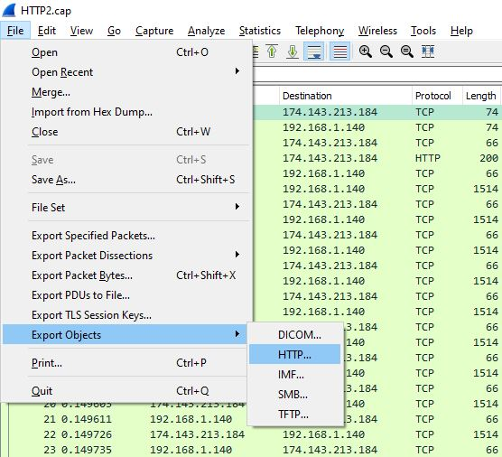

Next, you'll see a menu listing all of the packets with data that can be exported.

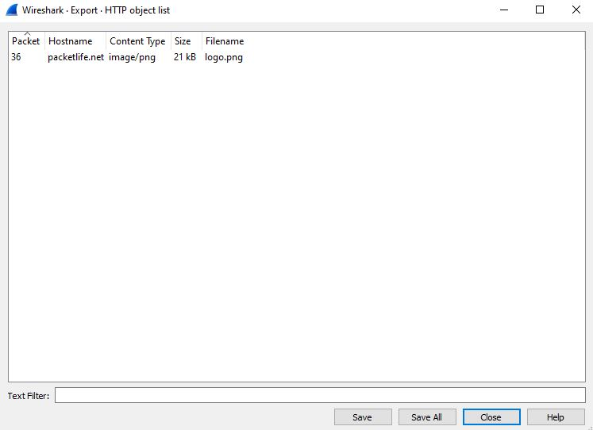

While in this case we only have one packet that transmitted a file, often times this menu will be filled with potential files for you to extract. For each item in this menu Wireshark provides the packet number (so you can easily find the packet to look at itself), the hostname from where the file was retrieved from, the content type, the file size, and the file name. This gives us all the information we need to know about the file we're looking at and how to save it when exporting it.

To actually export the file, select the item in the list and select the save option. Once you have it saved, you can open the file up to see what it included. In this case, we have a PacketLife logo.


Feel free to try this out on your own using the HTTP2.cap file stored in this repo.

### VoIP Analysis
The majority of modern day phones in your everyday office operate using VoIP, or Voice over IP, in order to communicate with other phones both in the office and outside of it. These phones transmit their data through their network and across the internet. As a result, just like any data sent across a network connection, the data they communicate is compromised of packets and can be captured in a PCAP file. In order to easily analyze these packets, Wireshark has a built-in "telephony" tool.

To understand how this data is analyzed, we need to examine the protocols at play during a VoIP phone call. The first protocol we're going to look at is the SIPS protocol. The SIPS protocol, or Session Initiation  Protocol, does exactly what you'd expect it to do: it initiates sessions. In this case these sessions are phone calls. The following image provides a glance at some SIPS traffic.

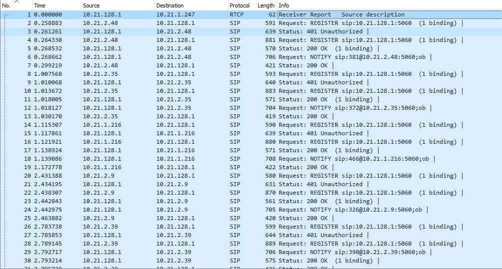

In this image, SIPS packets are being sent back and forth primarily registering new IP's for phones and notifying phones about notifications they have. To understand how the protocol begins a phone call, we can look at the following image.

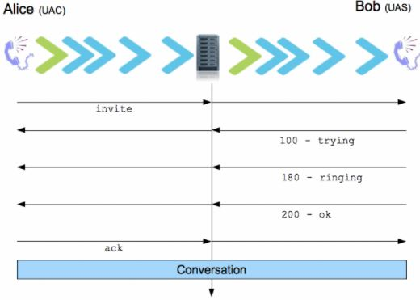

First, an "invite" packet is sent from one phone to another. Then, the other phone replies with a "trying" packet, a "ringing" packet, and finally an "ok" packet. Lastly, the original phone replies with an "ack" (acknowledgement) packet and the call begins.

Once the call begins, the two protocols RTP and RTCP take over. RTP stands for Real-time Transport Protocol and handles sending all of the packets containing the actual information communicated over the phone call (your voice and what you're saying). RTCP stands for RTP Control Protocol and controls the logistical portion of the phone call. It deals with packet loss, delay, and the overall quaility of the phone call and data transmission. The following image shows some RTP and RTCP packets.

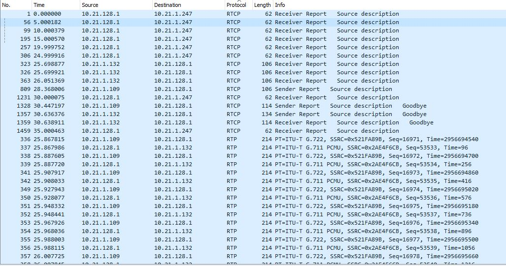

Now that we have an understanding of the forces at play during a VoIP call, let's look at how to analyze this data in Wireshark. As mentioned above, Wireshark has a section called "telephony" that enables you to analyze all of this data. To access it you go to the Telephony menu and then select the VoIP option.

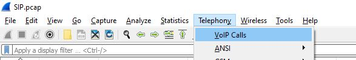

Next, you'll see a menu with different RTP streams to select from. Select one of them and click OK. This will result in a window popping up similar to the following image.

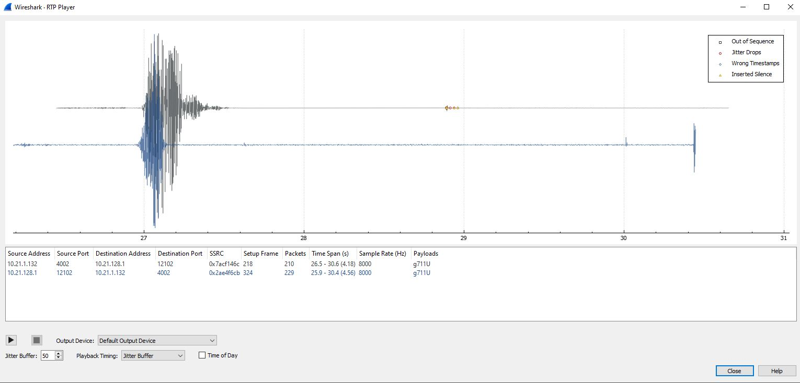

From here you can actually playback the phone call, listen in, and analyze what was said at differnet time stamps. If you'd like to try this yourself, download and use the SIP.pcap file.

Extracting files and analyzing VoIP calls are just a couple of advanced ways you can analyze data in Wireshark. Feel free to check out the Wireshark manual and explore other protocols out there to see what other data you can analzye in Wireshark!


## An Overview/Introduction to TShark
TShark is the terminal oriented version of Wireshark that can capture and display packets without the need for an interactive user interface. It supports the same options as Wireshak and without having any options set, TShark works in a similar way as a tcpdump. Tcpdump is a packet analyzer that executes in the command line. It allows the user to display TCP/IP packets being transmitted or received over a network that the computer is connected to. For more information on Wireshark consult your local manual page (`man shark`) or the online version at (https://www.wireshark.org/docs/man-pages/tshark.html).

### Help information available from `tshark`

```

TShark (Wireshark) 3.3.2 (v3.3.2rc0-16-g1936fef77a42)
Dump and analyze network traffic.
See https://www.wireshark.org for more information.

Usage: tshark [options] ...


Capture interface:
  -i <interface>, --interface <interface>
                           name or idx of interface (def: first non-loopback)
  -f <capture filter>      packet filter in libpcap filter syntax
  -s <snaplen>, --snapshot-length <snaplen>
                           packet snapshot length (def: appropriate maximum)
  -p, --no-promiscuous-mode
                           don't capture in promiscuous mode
  -I, --monitor-mode       capture in monitor mode, if available
  -B <buffer size>, --buffer-size <buffer size>
                           size of kernel buffer (def: 2MB)
  -y <link type>, --linktype <link type>
                           link layer type (def: first appropriate)
  --time-stamp-type <type> timestamp method for interface
  -D, --list-interfaces    print list of interfaces and exit
  -L, --list-data-link-types
                           print list of link-layer types of iface and exit
  --list-time-stamp-types  print list of timestamp types for iface and exit
  
  
Capture stop conditions:
  -c <packet count>        stop after n packets (def: infinite)
  -a <autostop cond.> ..., --autostop <autostop cond.> ...
                           duration:NUM - stop after NUM seconds
                           filesize:NUM - stop this file after NUM KB
                              files:NUM - stop after NUM files
                            packets:NUM - stop after NUM packets
                            
Capture output:
  -b <ringbuffer opt.> ..., --ring-buffer <ringbuffer opt.>
                           duration:NUM - switch to next file after NUM secs
                           filesize:NUM - switch to next file after NUM KB
                              files:NUM - ringbuffer: replace after NUM files
                            packets:NUM - switch to next file after NUM packets
                           interval:NUM - switch to next file when the time is
                                          an exact multiple of NUM secs
                                          
Input file:
  -r <infile>, --read-file <infile>
                           set the filename to read from (or '-' for stdin)

Processing:
  -2                       perform a two-pass analysis
  -M <packet count>        perform session auto reset
  -R <read filter>, --read-filter <read filter>
                           packet Read filter in Wireshark display filter syntax
                           (requires -2)
  -Y <display filter>, --display-filter <display filter>
                           packet displaY filter in Wireshark display filter
                           syntax
  -n                       disable all name resolutions (def: all enabled)
  -N <name resolve flags>  enable specific name resolution(s): "mnNtdv"
  -d <layer_type>==<selector>,<decode_as_protocol> ...
                           "Decode As", see the man page for details
                           Example: tcp.port==8888,http
  -H <hosts file>          read a list of entries from a hosts file, which will
                           then be written to a capture file. (Implies -W n)
  --enable-protocol <proto_name>
                           enable dissection of proto_name
  --disable-protocol <proto_name>
                           disable dissection of proto_name
  --enable-heuristic <short_name>
                           enable dissection of heuristic protocol
  --disable-heuristic <short_name>
                           disable dissection of heuristic protocol
                           
Output:
  -w <outfile|->           write packets to a pcapng-format file named "outfile"
                           (or '-' for stdout)
  --capture-comment <comment>
                           set the capture file comment, if supported
  -C <config profile>      start with specified configuration profile
  -F <output file type>    set the output file type, default is pcapng
                           an empty "-F" option will list the file types
  -V                       add output of packet tree        (Packet Details)
  -O <protocols>           Only show packet details of these protocols, comma
                           separated
  -P, --print              print packet summary even when writing to a file
  -S <separator>           the line separator to print between packets
  -x                       add output of hex and ASCII dump (Packet Bytes)
  -T pdml|ps|psml|json|jsonraw|ek|tabs|text|fields|?
                           format of text output (def: text)
  -j <protocolfilter>      protocols layers filter if -T ek|pdml|json selected
                           (e.g. "ip ip.flags text", filter does not expand child
                           nodes, unless child is specified also in the filter)
  -J <protocolfilter>      top level protocol filter if -T ek|pdml|json selected
                           (e.g. "http tcp", filter which expands all child nodes)
  -e <field>               field to print if -Tfields selected (e.g. tcp.port,
                           _ws.col.Info)
                           this option can be repeated to print multiple fields
  -E <fieldsoption>=<value> set options for output when -Tfields selected:
     bom=y|n               print a UTF-8 BOM
     header=y|n            switch headers on and off
     separator=/t|/s|<char> select tab, space, printable character as separator
     occurrence=f|l|a      print first, last or all occurrences of each field
     aggregator=,|/s|<char> select comma, space, printable character as
                           aggregator
     quote=d|s|n           select double, single, no quotes for values
  -t a|ad|adoy|d|dd|e|r|u|ud|udoy
                           output format of time stamps (def: r: rel. to first)
  -u s|hms                 output format of seconds (def: s: seconds)
  -l                       flush standard output after each packet
  -q                       be more quiet on stdout (e.g. when using statistics)
  -Q                       only log true errors to stderr (quieter than -q)
  -g                       enable group read access on the output file(s)
  -W n                     Save extra information in the file, if supported.
                           n = write network address resolution information
  -X <key>:<value>         eXtension options, see the man page for details
  -U tap_name              PDUs export mode, see the man page for details
  -z <statistics>          various statistics, see the man page for details
  --export-objects <protocol>,<destdir>
                           save exported objects for a protocol to a directory
                           named "destdir"
  --color                  color output text similarly to the Wireshark GUI,
                           requires a terminal with 24-bit color support
                           Also supplies color attributes to pdml and psml formats
                           (Note that attributes are nonstandard)
  --no-duplicate-keys      If -T json is specified, merge duplicate keys in an object
                           into a single key with as value a json array containing all
                           values
  --elastic-mapping-filter <protocols> If -G elastic-mapping is specified, put only the
                           specified protocols within the mapping file

Miscellaneous:

  -h, --help               display this help and exit
  -v, --version            display version info and exit
  -o <name>:<value> ...    override preference setting
  -K <keytab>              keytab file to use for kerberos decryption
  -G [report]              dump one of several available reports and exit
                           default report="fields"
                           use "-G help" for more help
                           
 ```


To begin capturing packets with TShark you would use the following syntax within the terminal window: 

`tshark -i wlan0 -w captureOutput.pcap`

To help breakdown the above syntax, it reads as `tshark [-i <capture interface> wlan0 <wifi card> -w <outfile>]`.

After writing to the captureOuput.pcap file you can read the file with the following syntax:

`tshark -r captureOutput.pcap`

With having some basics covered, we may now get into some scripts written within different programming languages. Some languages that will be covered are BASH, Python, and Ruby.  

### BASH

#### Generates traffic with netcat, ping, hping, etc. It then saves it with tshark.
```
function save_ping() {
    tshark -w ping.pcap -f "host 8.8.8.8" -c 1
    ping 8.8.8.8 -c 1
}
save_ping
```

### Python

#### Sends a ping to a specific IP address
```
# send_ping.py
from scapy.all import *
ans, unans = sr(IP(dst="8.8.8.8")/ICMP()/"Scapy is easy!")
```
#### Writes the ping and its reply to a file
```wrpcap("ping.pcap",ans+unans)```


If you want to live-capture with scapy [it should be possible]```(/capture/sources/downloading_file#scapy)``` on systems with tail.

### Ruby

#### Script sends a ping to the wire
```
send_ping.rb
require 'packetfu'

Using :config prepoulates eth_src, eth_dst, and ip_src with system values.
icmp_pkt = PacketFu::ICMPPacket.new(:config => PacketFu::Utils.whoami?)
icmp_pkt.icmp_type = 8
icmp_pkt.icmp_code = 0
icmp_pkt.payload = "PacketFu is easy!"
icmp_pkt.ip_daddr="8.8.8.8"
icmp_pkt.recalc
```

#### Writes the generated ping to a file.
```icmp_pkt.to_w```

#### Send a ping to the wire.
```icmp_pkt.to_f("ping.pcap")```

TShark offers a wide variety of services as well as offering a lot of customization to help the user better navigate the program. 


## References

(Network Forensics)  
https://en.wikipedia.org/wiki/Network_forensics

(Intro to Wireshark)  
https://medium.com/better-programming/intro-to-wireshark-2abe7fb24f53

(What is Wireshark)  
https://ctf101.org/forensics/what-is-wireshark/

(TCP)  
https://en.wikipedia.org/wiki/Transmission_Control_Protocol

(TCP/IP Packets)  
https://inc0x0.com/tcp-ip-packets-introduction/tcp-ip-packets-3-manually-create-and-send-raw-tcp-ip-packets/

(TCP/IP Packets)  
https://inc0x0.com/tcp-ip-packets-introduction/tcp-ip-packets-2-analysis-of-a-raw-tcp-ip-packet/

(For Installation)  
https://www.wireshark.org/docs/wsug_html_chunked/

(For PCAPS)  
https://nationalcyberleague.org/

(For RTP/RTCP)  
https://tools.ietf.org/html/rfc3550

(For Sips)  
https://www.unicoi.com/fusion_secure/fusion_sips.htm

(TShark [Terminal Based Wireshark])  
https://www.wireshark.org/docs/wsug_html_chunked/AppToolstshark.html

(Script Packets)  
https://tshark.dev/packetcraft/scripting/scripted_gen/#bash-various

(TShark Info)  
https://www.wireshark.org/docs/man-pages/tshark.html

(Tcpdump Info)  
https://www.tcpdump.org/

(Wireshark)  
https://www.wireshark.org/docs/wsug_html_chunked/

(Wireshark Wiki)  
https://wiki.wireshark.org/

(PCAP Files)  
https://cyberskyline.com/

(TShark)  
https://tshark.dev/


## Video Links
[TCP/IP packet structure & Overview/Introduction to Wireshark](https://app.vidgrid.com/view/qWYvPIgPth4j)
[Basic Packet Analysis, Sorting, and Filtering in Wireshark](https://youtu.be/QX1lGAgj8uI)
[Advanced Packet Analysis in Wireshark](https://app.vidgrid.com/view/qWYvPIgPth4j)


