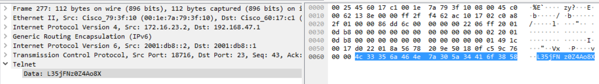

# Digital Forensics Network Forensics Challenge
## Created by: Tom Danner, Devin Ingresoll, Jesse Reed, Vitaliy Tsytsyk

### Software/Tools Used:
<p align="center">
  
</p>

#### Overview

Wireshark is a tool used for capturing/sniffing packets and analyzing packet captures.

#### Installing Wireshark
Windows/macOS: You can download the installer from their website here: https://www.wireshark.org/

Linux: Search for wireshark-qt using your respective distro's methods and select the most up to date version. A few have been included here.

Ubuntu

`sudo apt-get install wireshark`

Arch

`sudo pacman -S wireshark-qt`

Redhat/CentOS
```
sudo yum install gcc gcc-c++ bison flex libpcap-devel qt-devel gtk3-devel rpm-build libtool c-ares-devel qt5-qtbase-devel qt5-qtmultimedia-devel qt5-linguist desktop-file-utils
sudo yum install wireshark wireshark-qt
```

<p align="center">
  
</p>

#### Overview

TShark is the CLI counterpart of Wireshark. It enables the user to perform many of the same tasks they can do in Wireshark through the CLI instead. It also allows users to create scripts to automate the packet capture analysis process.

#### Installing TShark
Windows: (Requires choclatey to be installed) `choco install wireshark`

macOS: (Requires brew to be installed) `brew cask install wireshark`

Linux: By default it is included when installing Wireshark. Refer to the Wireshark installation steps for your respective distro.

### Topics Covered:
1. TCP/IP packet structure. An Overview/Introduction to Wireshark.
2. Basic Packet Analysis in Wireshark.
3. Advanced Packet Analysis in Wireshark.
4. An Overview/Introduction to TShark.

## Overview:
Network Forensics is a crucial part of digital forensics and its importance continues to grow everyday.
Almost all personal computers and servers are going to have built-in networking capabilities, such as wi-fi or ethernet, allowing them to communicate with other devices across the internet.
These connections can be used to transfer illegal files, deny normal service, and allow malware to go on and become viral.                                                                                                                                                           

Network data can also be difficult to track due to the huge volume and voliticity of conversations between devices.                                                                                                                                                                      
As a result of this, networking data has to be deliberatly listened to and saved for analysis in order to extract evidence. This is called "sniffing."                                                                                                                                                                

In our overview of network forensics we will first cover the most common language that computers communicate with: the TCP/IP packet structure.                                                                                                                              
After we learn how to read these, we'll dive into how you can aquire and analyse network information with one of the most common tools in the field: Wireshark!                                                                                                                  
Once we have the basics down, we'll lastly take a look at some more advanced topics dealing with Wireshark and TShark.


## TCP/IP packet structure and An Overview/Introduction to Wireshark
### Opening a Packet
So before we dive deep into Wireshark, we first need to understand what we will be looking at.  
This all starts with understanding the IP packet structure\!  
When we look at network traffic we will often be looking at TCP/IP packets so this is where we will start.  
 


*This is what a packet looks like in Wireshark.*  

We can see the HEX and ASCII text on the right side and what this translates to on the left.  
Almost all packets can be understood using the seven layers of the OSI / networking model:  

- **Physical Layer**        
_Includes information about the packet as a whole_   
  - Arrival Time  
  - Encapsulation type (usually Ethernet)      
  - Frame number and length  
  - Protocol inside          
- **Data Link layer**  
_Transferring from device <-> device_
  - Destination and Source MAC address        
- **Network Layer**  
_Usually over IPv4 or IPv6_  
_client <-> host_         
  - IP addresses of client and server
  - IP version
  - Time to live
- **Transport Layer**  
_Usually either TCP or UDP_
  - Source and Destination Port number
  - Sequence number
- **Session/Application Layer (_the rest of it_)**  
_The actual protocol data_
  - depends on which protocol is used
  - in our example, Telnet includes data such as a **password** being sent in plain text!!!
  
Having a basic understanding of how packets can be analyzed will help greatly as we look more into network forensics with Wireshark.

### Using Wireshark
After installing, and running the software we need to select a network device to start monitoring (named eth0, Wi-Fi, etc)  
 > **NOTE:** Program may need to be ran as an _Administrator_    

Once we select a device we immediately start collecting incoming packets.
There are four main windows here:
 - Command Menu w/ Display filter
 - Packet Listing
 - Packet Details 
 - Packet Bytes  
 
To pause the current session, click the red square at the top right (start again with the green fin)  
You can click on any packet to further analyze in the _Packet Details_ and _Packet Bytes_ frames.

In the Packet Listing section, you can see the Packet Number, time since first packet, Source and Destination IP address, Protocol, Length of the package in bytes and :star: package info :star:  
Package info is very useful for gaining quick intel.  
If you're wondering what a specific protocol does, your friend Google is always there to help! 

This is really all you need to know to get started in Wireshark, so lets start looking at some of the cool things you can do!

## Basic Packet Analysis in Wireshark


## Advanced Packet Analysis in Wireshark
Aside from basic packet analysis, there's significantly more Wireshark is capable of. In this section we'll examine two ways Wireshark can go beyond simply looking at packets: extracting files and VoIP analysis.

### Extracting Files
When analyzing PCAP files, it's not uncommon to come across HTTP packets that were sent to request files be retrieved such as images when visiting websites, websites themselves, videos, and more. While we can get an idea of what the file might look like just from examining the packet, we can take it a step further and reconstruct/export the file to view ourselves. 

In order to do this, first go to the File menu, mouse down to the Export Objects menu, and then select the HTTP option.


Next, you'll see a menu listing all of the packets with data that can be exported.


While in this case we only have one packet that transmitted a file, often times this menu will be filled with potential files for you to extract. For each item in this menu Wireshark provides the packet number (so you can easily find the packet to look at itself), the hostname from where the file was retrieved from, the content type, the file size, and the file name. This gives us all the information we need to know about the file we're looking at and how to save it when exporting it.

To actually export the file, select the item in the list and select the save option. Once you have it saved, you can open the file up to see what it included. In this case, we have a PacketLife logo.


Feel free to try this out on your own using the HTTP2.cap file stored in this repo.

### VoIP Analysis
The majority of modern day phones in your everyday office operate using VoIP, or Voice over IP, in order to communicate with other phones both in the office and outside of it. These phones transmit their data through their network and across the internet. As a result, just like any data sent across a network connection, the data they communicate is compromised of packets and can be captured in a PCAP file. In order to easily analyze these packets, Wireshark has a built-in "telephony" tool.

To understand how this data is analyzed, we need to examine the protocols at play during a VoIP phone call. The first protocol we're going to look at is the SIPS protocol. The SIPS protocol, or Session Initiation  Protocol, does exactly what you'd expect it to do: it initiates sessions. In this case these sessions are phone calls. The following image provides a glance at some SIPS traffic.


In this image, SIPS packets are being sent back and forth primarily registering new IP's for phones and notifying phones about notifications they have. To understand how the protocol begins a phone call, we can look at the following image.


First, an "invite" packet is sent from one phone to another. Then, the other phone replies with a "trying" packet, a "ringing" packet, and finally an "ok" packet. Lastly, the original phone replies with an "ack" (acknowledgement) packet and the call begins.

Once the call begins, the two protocols RTP and RTCP take over. RTP stands for Real-time Transport Protocol and handles sending all of the packets containing the actual information communicated over the phone call (your voice and what you're saying). RTCP stands for RTP Control Protocol and controls the logistical portion of the phone call. It deals with packet loss, delay, and the overall quaility of the phone call and data transmission. The following image shows some RTP and RTCP packets.


Now that we have an understanding of the forces at play during a VoIP call, let's look at how to analyze this data in Wireshark. As mentioned above, Wireshark has a section called "telephony" that enables you to analyze all of this data. To access it you go to the Telephony menu and then select the VoIP option.


Next, you'll see a menu with different RTP streams to select from. Select one of them and click OK. This will result in a window popping up similar to the following image.


From here you can actually playback the phone call, listen in, and analyze what was said at differnet time stamps. If you'd like to try this yourself, download and use the SIP.pcap file.

Extracting files and analyzing VoIP calls are just a couple of advanced ways you can analyze data in Wireshark. Feel free to check out the Wireshark manual and explore other protocols out there to see what other data you can analzye in Wireshark!

## An Overview/Introduction to TShark
TShark is the terminal oriented version of Wireshark that can capture and display packets without the need for an interactive user interface. Without having any options set, TShark works in a similar way as a tcpdump. To begin capturing packets with TShark you would use the following syntax within the terminal window: 

`tshark -i wlan0 -w captureOutput.pcap`

To help breakdown the above syntax, it reads as `tshark [-i <capture interface> wlan0 <wifi card> -w <outfile>]`.

After writing to the captureOuput.pcap file you can read the file with the following syntax:

`tshark -r captureOutput.pcap`

TShark offers a plethora of options to help specify any search vectors. A few examples of some options would be as follows.

- `-a| --autostop <capture autostop condition>` which tells TShark when to stop writing to the capture file. 

- `-c <capture packet count>` which sets the maximum number of packets to read when capturing live data. 

- `-2 <two-pass analysis>` which causes TShark to buffer an output until the entire first pass is done. 

These are just a few of the options that TShark allows. If you have questions feel free to reference `tshark -h` or `tshark --help` within the terminal window.


## References
